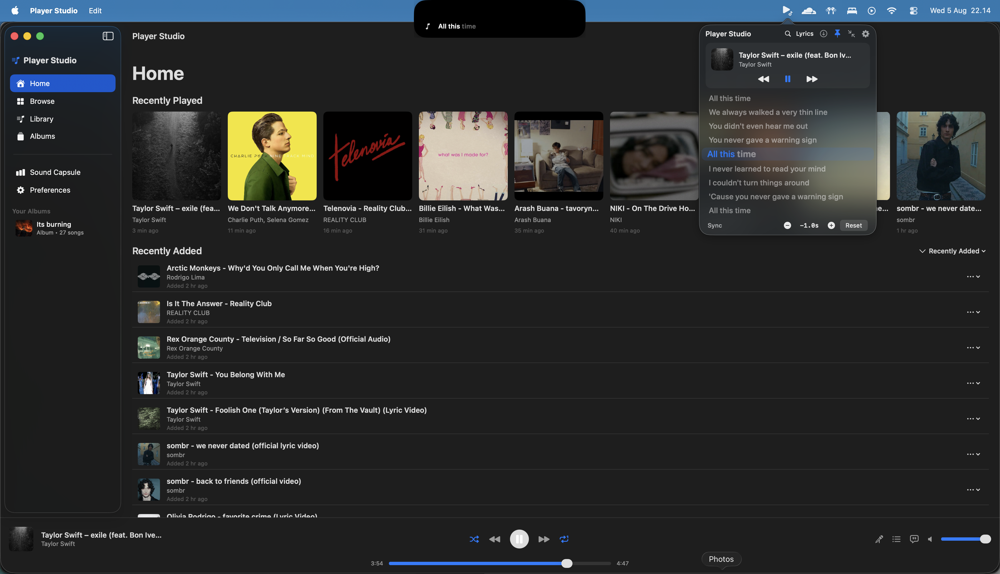

# Player Studio

A native macOS music player with a local library, YouTube discovery, synced lyrics, karaoke, listening insights, and a Dynamic-Island-style player under the notch.



Player Studio started from [Verse Bar](https://github.com/alvinindra/verse-bar) by [Alvin Indra](https://github.com/alvinindra). The project has since moved in a different direction and is now maintained as an independent app. Alvin remains credited for the original Music Island/notch code and the foundation that made this project possible.

## Features

- **Full desktop player** — queue, shuffle, repeat, seeking, volume, media keys, and system Now Playing integration
- **Local music library** — recently played, recently added, search, sorting, and custom albums
- **YouTube discovery** — search or paste a YouTube URL, stream immediately, or download for offline playback
- **Synced lyrics** — line- and word-level timing, manual lyric selection, per-track sync offsets, caching, and CJK romanization
- **Music Island** — compact lyrics and playback controls beneath the MacBook notch
- **Menu bar and popover** — live lyrics and playback controls without opening the main window
- **Karaoke** — Demucs vocal separation, live pitch visualization, microphone monitoring, and singing scores
- **Sound Capsule** — monthly listening history, rankings, streaks, and trends
- **Discord Rich Presence** — optional current-track activity with artwork and a listening link
- **Touch Bar controls**, track-change notifications, launch at login, offline mode, and update checks

Lyrics are provided by [LRCLIB](https://lrclib.net). YouTube search and downloads use bundled [`yt-dlp`](https://github.com/yt-dlp/yt-dlp) and FFmpeg binaries.

## Install

Player Studio requires macOS 14 or newer.

```bash
git clone https://github.com/fauzanazz/verse-bar.git
cd verse-bar
./build.sh
open "Player Studio.app"
```

Move `Player Studio.app` to `/Applications` so macOS can retain its permissions.

If macOS blocks the ad-hoc-signed app, use **System Settings → Privacy & Security → Open Anyway**, or run:

```bash
xattr -dr com.apple.quarantine "/Applications/Player Studio.app"
```

The first-run guide handles the remaining setup. Karaoke vocal separation is optional and requires [Demucs](https://github.com/facebookresearch/demucs); Player Studio can install it when `uv` is available.

## Development

Build, architecture, testing, and release details are in [`docs/DEVELOPMENT.md`](docs/DEVELOPMENT.md).

```bash
swift build
swift test
```

## Credits

- [Alvin Indra](https://github.com/alvinindra), creator of the original [Verse Bar](https://github.com/alvinindra/verse-bar) and author of the original Music Island/notch implementation
- [LRCLIB](https://lrclib.net) for synced lyrics
- [Lyricfier](https://github.com/emilioastarita/lyricfier) and [SpotMenu](https://github.com/kmikiy/SpotMenu) for inspiration

## License

MIT — see [LICENSE](LICENSE).
